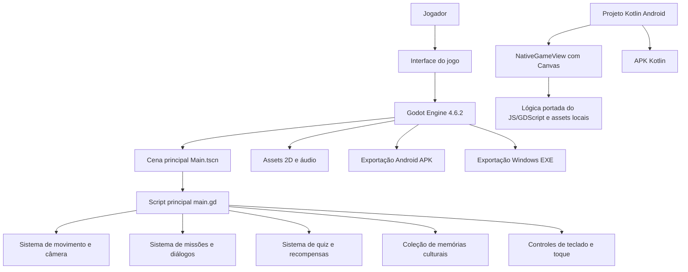

# Sim-Bora Piauí

MVP de jogo digital 2D educativo sobre patrimônio histórico, cultural e geográfico do Piauí, desenvolvido para a trilha de Tecnologia da Informação da SEDUC-PI. A proposta transforma pontos de memória, paisagens, personagens e saberes locais em uma experiência jogável, com exploração, diálogos, missões e coleção cultural.

O MVP é funcional e validável: pode ser executado no Android, no Windows ou aberto pelo projeto-fonte no Godot. O foco desta versão é demonstrar a viabilidade técnica da solução e o valor pedagógico da proposta, sem depender de um produto final completo.

## Links rápidos

* Repositório: [https://github.com/nt8816/sim-bora-piaui](https://github.com/nt8816/sim-bora-piaui)
* APK Android Kotlin: [https://github.com/nt8816/sim-bora-piaui/raw/main/Simbora-Piaui/builds/android/sim-bora-piaui-kotlin-debug.apk](https://github.com/nt8816/sim-bora-piaui/raw/main/Simbora-Piaui/builds/android/sim-bora-piaui-kotlin-debug.apk)
* APK Android Godot: [https://github.com/nt8816/sim-bora-piaui/raw/main/Simbora-Piaui/builds/android/sim-bora-piaui-debug.apk](https://github.com/nt8816/sim-bora-piaui/raw/main/Simbora-Piaui/builds/android/sim-bora-piaui-debug.apk)
* Executável Windows: [https://github.com/nt8816/sim-bora-piaui/raw/main/Simbora-Piaui/builds/windows/Sim-Bora-Piaui.exe](https://github.com/nt8816/sim-bora-piaui/raw/main/Simbora-Piaui/builds/windows/Sim-Bora-Piaui.exe)
* Projeto Godot: [`Simbora-Piaui/godot/project.godot`](Simbora-Piaui/godot/project.godot)

> Observação: os arquivos grandes do projeto usam Git LFS. Pelo navegador, os links acima baixam os arquivos diretamente. Ao clonar o repositório, instale o Git LFS e rode `git lfs pull`.

## Equipe

* Érika Tauane
* Joyce Rodrigues
* Tiago Araújo
* Natan Araújo
* Maria Vitória

Orientador: Lucas Albuquerque Moura
Escola: CETI Dr. João Carvalho, Dom Expedito Lopes-PI
Trilha: Tecnologia da Informação, SEDUC-PI

## Problema

Muitos estudantes conhecem pouco o patrimônio cultural, histórico e geográfico do próprio território. Em geral, esse conteúdo aparece de forma fragmentada, distante da linguagem digital que faz parte do cotidiano dos jovens.

O Sim-Bora Piauí propõe uma forma lúdica de aproximar estudantes da memória local, usando um jogo 2D como ferramenta de aprendizagem, exploração e valorização cultural.

## Solução

O jogador explora uma versão 2D inspirada em Picos-PI, interage com personagens, visita pontos de interesse, registra memórias e cumpre missões educativas. A experiência combina:

* exploração top-down em mapa 2D;
* narrativa com personagens locais;
* missões culturais e educativas;
* quiz e diálogos sobre pontos históricos;
* coleção de memórias desbloqueáveis;
* controles para computador e Android;
* builds exportados para avaliação rápida.

## Conteúdo do MVP

Esta versão demonstra a primeira etapa da jornada:

* tela inicial com identidade visual do projeto;
* introdução narrativa em Picos;
* mapa explorável com praça, ruas, feira, igreja, museu, rio e áreas de memória;
* personagens como Seu Zé, Dona Rita e Ana;
* missões ligadas à cultura, memória, feira, Museu Ozildo Albano, Igreja de Picos e Rio Guaribas;
* sistema de diálogos, respostas e recompensas;
* álbum/coleção cultural;
* suporte a teclado e controle virtual no Android;
* APK Android.

## Tecnologias utilizadas

* Godot Engine 4.6.2
* GDScript
* Kotlin
* Android Canvas nativo
* Gradle / Android Gradle Plugin
* Android SDK / Build Tools 35
* Java 17
* Git e GitHub
* Git LFS para versionamento dos binários grandes
* Assets 2D próprios e adaptados para o MVP
* Audacity
* LibreSprite
* VS Code
* Protipagem web (HTML, CSS  e JavaScript)

## Como baixar e executar

### Android

1. Baixe o APK Kotlin pelo link:
   [https://github.com/nt8816/sim-bora-piaui/raw/main/Simbora-Piaui/builds/android/sim-bora-piaui-kotlin-debug.apk](https://github.com/nt8816/sim-bora-piaui/raw/main/Simbora-Piaui/builds/android/sim-bora-piaui-kotlin-debug.apk)
2. Transfira o arquivo para o celular, se estiver baixando pelo computador.
3. No Android, permita a instalação de app de fonte externa quando o sistema solicitar.
4. Instale o APK.
5. Abra o app `Sim-Bora Piauí`.

Arquivo no repositório:

```text
Simbora-Piaui/builds/android/sim-bora-piaui-kotlin-debug.apk
```

Também existe o APK exportado pelo Godot:

```text
Simbora-Piaui/builds/android/sim-bora-piaui-debug.apk
```

### Windows

1. Baixe o executável:
   [https://github.com/nt8816/sim-bora-piaui/raw/main/Simbora-Piaui/builds/windows/Sim-Bora-Piaui.exe](https://github.com/nt8816/sim-bora-piaui/raw/main/Simbora-Piaui/builds/windows/Sim-Bora-Piaui.exe)
2. Abra o arquivo `Sim-Bora-Piaui.exe`.
3. Se o Windows exibir um aviso de segurança por ser um executável baixado da internet, escolha a opção de executar mesmo assim apenas se o arquivo veio deste repositório oficial.

Arquivo no repositório:

```text
Simbora-Piaui/builds/windows/Sim-Bora-Piaui.exe
```

### Linux e macOS pelo Godot

Ainda não há build nativo pronto para Linux/macOS neste repositório. Nessas plataformas, a forma recomendada de executar é pelo Godot:

1. Instale o Godot Engine 4.6.2.
2. Clone o repositório:

```bash
git clone https://github.com/nt8816/sim-bora-piaui.git
cd sim-bora-piaui
```

3. Se quiser baixar também os binários grandes versionados no LFS:

```bash
git lfs install
git lfs pull
```

4. Abra o Godot.
5. Clique em `Importar`.
6. Selecione:

```text
Simbora-Piaui/godot/project.godot
```

7. Abra a cena principal:

```text
res://scenes/Main.tscn
```

8. Pressione `F5` para executar.

### Web / navegador

O repositório também mantém um protótipo web em:

```text
Simbora-Piaui/index.html
Simbora-Piaui/game.js
Simbora-Piaui/style.css
```

Esse protótipo serve como referência visual e de experimentação. A versão principal do MVP, para avaliação técnica, é a versão Godot.

O APK Kotlin usa uma versão nativa em `Canvas`, escrita em Kotlin a partir da lógica do protótipo web e do GDScript. Os assets continuam locais dentro do aplicativo.

## Como jogar

* No computador: use `WASD` ou as setas para andar.
* Interação: pressione `F` perto de personagens, locais ou missões.
* Menu/coleção: use os botões na interface.
* No Android: use o controle virtual na tela e o botão de interação.
* Objetivo: explore Picos, converse com personagens, registre memórias, complete missões e desbloqueie conhecimentos culturais.

## Estrutura do repositório

```text
Simbora-Piaui/
  godot/
    project.godot
    scenes/Main.tscn
    scripts/main.gd
    assets/
  builds/
    android/sim-bora-piaui-debug.apk
    windows/Sim-Bora-Piaui.exe
    templates/
  index.html
  game.js
  style.css
android-kotlin/
  app/src/main/java/br/com/simbora/piaui/MainActivity.kt
  app/build.gradle
  settings.gradle
```

## Arquitetura da solução



### Componentes principais

* `project.godot`: configuração do projeto, mapa de entradas e definições gerais.
* `scenes/Main.tscn`: cena principal carregada pelo Godot.
* `scripts/main.gd`: concentra a lógica do MVP, incluindo mapa, jogador, missões, diálogos, coleção e interface.
* `assets/`: imagens, sprites, texturas e áudio usados no jogo.
* `builds/android/`: APK Android pronto para teste.
* `builds/windows/`: executável Windows pronto para teste.
* `android-kotlin/`: projeto Android Kotlin nativo com `NativeGameView`, `Canvas`, toque, diálogos, missões e assets locais.

## Como compilar/exportar

### Rodar pelo editor

```bash
cd Simbora-Piaui/godot
godot --path . --editor
```

No editor, pressione `F5`.

### Exportar Android

Requisitos:

* Godot Engine 4.6.2
* Java 17
* Android SDK instalado
* Build Tools 35
* Git LFS, caso o repositório tenha sido clonado sem baixar os binários

O preset Android está em:

```text
Simbora-Piaui/godot/export_presets.cfg
```

O build entregue para avaliação já está pronto em:

```text
Simbora-Piaui/builds/android/sim-bora-piaui-debug.apk
```

### Compilar APK Kotlin

Requisitos:

* Java 17
* Android SDK instalado
* Git LFS, para baixar o APK e demais binários grandes quando necessário

Comando:

```bash
cd android-kotlin
./gradlew assembleDebug
```

O APK gerado fica em:

```text
android-kotlin/app/build/outputs/apk/debug/app-debug.apk
```

O APK Kotlin versionado no repositório fica em:

```text
Simbora-Piaui/builds/android/sim-bora-piaui-kotlin-debug.apk
```

Observação: a versão Kotlin nativa não carrega HTML em `WebView`. A Activity abre uma `NativeGameView` escrita em Kotlin, que redesenha o jogo com `Canvas` e mantém a jornada principal: introdução, câmera, mototáxi, Seu Zé, Dona Rita, Ana, páginas do diário, coleção, marketplace e desbloqueio da Capadócia.

## Histórico de commits e contribuições

O repositório foi organizado com commits pequenos para facilitar a avaliação do processo de desenvolvimento. Os commits recentes documentam:

* correção do APK Android;
* inclusão de arquivos grandes via Git LFS;
* adição de templates do Godot;
* adição de build Windows;
* adição de arquivos Android necessários ao projeto;
* adição do APK Kotlin com Git LFS;
* atualização do README a cada entrega relevante;
* organização dos artefatos de build.

Para avaliação do hackathon, o histórico pode ser consultado em:

```bash
git log --oneline
```

Ou diretamente no GitHub, pela aba `Commits` do repositório.

## Observações para avaliadores

Este projeto é um MVP. O objetivo é demonstrar a viabilidade técnica e pedagógica da solução: um jogo 2D capaz de apresentar patrimônio local de forma interativa, executável e validável. A versão atual prioriza Picos-PI como recorte inicial e pode ser expandida para outras cidades, fases, missões e conteúdos culturais do Piauí.
