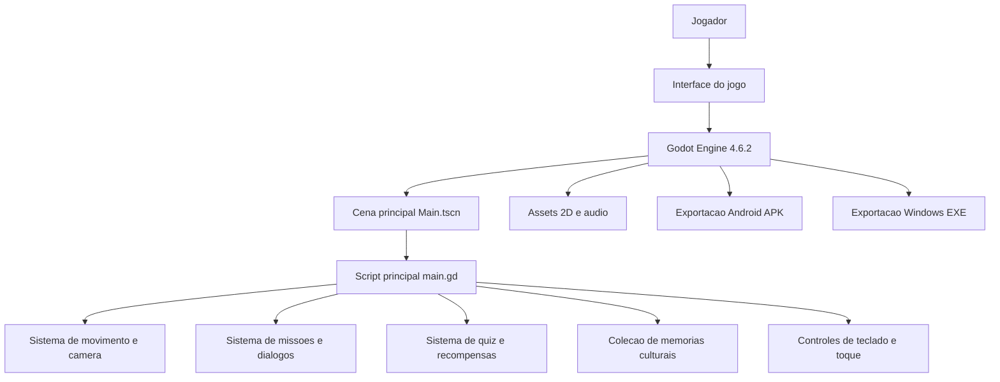

# Sim-Bora Piaui

MVP de jogo digital 2D educativo sobre patrimonio historico, cultural e geografico do Piaui, desenvolvido para a trilha de Tecnologia da Informacao da SEDUC-PI. A proposta transforma pontos de memoria, paisagens, personagens e saberes locais em uma experiencia jogavel, com exploracao, dialogos, missoes e colecao cultural.

O MVP e funcional e validavel: pode ser executado no Android, no Windows ou aberto pelo projeto-fonte no Godot. O foco desta versao e demonstrar a viabilidade tecnica da solucao e o valor pedagogico da proposta, sem depender de um produto final completo.

## Links rapidos

- Repositorio: <https://github.com/nt8816/sim-bora-piaui>
- APK Android: <https://github.com/nt8816/sim-bora-piaui/raw/main/Simbora-Piaui/builds/android/sim-bora-piaui-debug.apk>
- Executavel Windows: <https://github.com/nt8816/sim-bora-piaui/raw/main/Simbora-Piaui/builds/windows/Sim-Bora-Piaui.exe>
- Projeto Godot: [`Simbora-Piaui/godot/project.godot`](Simbora-Piaui/godot/project.godot)

> Observacao: os arquivos grandes do projeto usam Git LFS. Pelo navegador, os links acima baixam os arquivos diretamente. Ao clonar o repositorio, instale o Git LFS e rode `git lfs pull`.

## Equipe

- Erika Tauane
- Joyce Rodrigues
- Tiago Araujo
- Natan Araujo
- Maria Vitoria

Orientador: Lucas Albuquerque Moura  
Escola: CETI Dr. Joao Carvalho, Dom Expedito Lopes-PI  
Trilha: Tecnologia da Informacao, SEDUC-PI

## Problema

Muitos estudantes conhecem pouco o patrimonio cultural, historico e geografico do proprio territorio. Em geral, esse conteudo aparece de forma fragmentada, distante da linguagem digital que faz parte do cotidiano dos jovens.

O Sim-Bora Piaui propõe uma forma lúdica de aproximar estudantes da memoria local, usando um jogo 2D como ferramenta de aprendizagem, exploracao e valorizacao cultural.

## Solucao

O jogador explora uma versao 2D inspirada em Picos-PI, interage com personagens, visita pontos de interesse, registra memorias e cumpre missoes educativas. A experiencia combina:

- exploracao top-down em mapa 2D;
- narrativa com personagens locais;
- missoes culturais e educativas;
- quiz e dialogos sobre pontos historicos;
- colecao de memorias desbloqueaveis;
- controles para computador e Android;
- builds exportados para avaliacao rapida.

## Conteudo do MVP

Esta versao demonstra a primeira etapa da jornada:

- tela inicial com identidade visual do projeto;
- introducao narrativa em Picos;
- mapa exploravel com praca, ruas, feira, igreja, museu, rio e areas de memoria;
- personagens como Seu Ze, Dona Rita e Ana;
- missoes ligadas a cultura, memoria, feira, Museu Ozildo Albano, Igreja de Picos e Rio Guaribas;
- sistema de dialogos, respostas e recompensas;
- album/colecao cultural;
- suporte a teclado e controle virtual no Android;
- APK Android corrigido, com os dados do projeto empacotados corretamente.

## Tecnologias utilizadas

- Godot Engine 4.6.2
- GDScript
- Android SDK / Build Tools 35
- Java 17
- Git e GitHub
- Git LFS para versionamento dos binarios grandes
- Assets 2D proprios e adaptados para o MVP

## Como baixar e executar

### Android

1. Baixe o APK pelo link:
   <https://github.com/nt8816/sim-bora-piaui/raw/main/Simbora-Piaui/builds/android/sim-bora-piaui-debug.apk>
2. Transfira o arquivo para o celular, se estiver baixando pelo computador.
3. No Android, permita a instalacao de app de fonte externa quando o sistema solicitar.
4. Instale o APK.
5. Abra o app `Sim-Bora Piaui`.

Arquivo no repositorio:

```text
Simbora-Piaui/builds/android/sim-bora-piaui-debug.apk
```

### Windows

1. Baixe o executavel:
   <https://github.com/nt8816/sim-bora-piaui/raw/main/Simbora-Piaui/builds/windows/Sim-Bora-Piaui.exe>
2. Abra o arquivo `Sim-Bora-Piaui.exe`.
3. Se o Windows exibir um aviso de seguranca por ser um executavel baixado da internet, escolha a opcao de executar mesmo assim apenas se o arquivo veio deste repositorio oficial.

Arquivo no repositorio:

```text
Simbora-Piaui/builds/windows/Sim-Bora-Piaui.exe
```

### Linux e macOS pelo Godot

Ainda nao ha build nativo pronto para Linux/macOS neste repositorio. Nessas plataformas, a forma recomendada de executar e pelo Godot:

1. Instale o Godot Engine 4.6.2.
2. Clone o repositorio:

```bash
git clone https://github.com/nt8816/sim-bora-piaui.git
cd sim-bora-piaui
```

3. Se quiser baixar tambem os binarios grandes versionados no LFS:

```bash
git lfs install
git lfs pull
```

4. Abra o Godot.
5. Clique em `Importar`.
6. Selecione:

```text
Simbora-Piaui/godot/project.godot
```

7. Abra a cena principal:

```text
res://scenes/Main.tscn
```

8. Pressione `F5` para executar.

### Web / navegador

O repositorio tambem mantem um prototipo web em:

```text
Simbora-Piaui/index.html
Simbora-Piaui/game.js
Simbora-Piaui/style.css
```

Esse prototipo serve como referencia visual e de experimentacao. A versao principal do MVP, para avaliacao tecnica, e a versao Godot.

## Como jogar

- No computador: use `WASD` ou as setas para andar.
- Interacao: pressione `F` perto de personagens, locais ou missoes.
- Menu/colecao: use os botoes na interface.
- No Android: use o controle virtual na tela e o botao de interacao.
- Objetivo: explore Picos, converse com personagens, registre memorias, complete missoes e desbloqueie conhecimentos culturais.

## Estrutura do repositorio

```text
Simbora-Piaui/
  godot/
    project.godot
    scenes/Main.tscn
    scripts/main.gd
    assets/
  builds/
    android/sim-bora-piaui-debug.apk
    windows/Sim-Bora-Piaui.exe
    templates/
  index.html
  game.js
  style.css
```

## Arquitetura da solucao



### Componentes principais

- `project.godot`: configuracao do projeto, mapa de entradas e definicoes gerais.
- `scenes/Main.tscn`: cena principal carregada pelo Godot.
- `scripts/main.gd`: concentra a logica do MVP, incluindo mapa, jogador, missoes, dialogos, colecao e interface.
- `assets/`: imagens, sprites, texturas e audio usados no jogo.
- `builds/android/`: APK Android pronto para teste.
- `builds/windows/`: executavel Windows pronto para teste.

## Como compilar/exportar

### Rodar pelo editor

```bash
cd Simbora-Piaui/godot
godot --path . --editor
```

No editor, pressione `F5`.

### Exportar Android

Requisitos:

- Godot Engine 4.6.2
- Java 17
- Android SDK instalado
- Build Tools 35
- Git LFS, caso o repositorio tenha sido clonado sem baixar os binarios

O preset Android esta em:

```text
Simbora-Piaui/godot/export_presets.cfg
```

O build entregue para avaliacao ja esta pronto em:

```text
Simbora-Piaui/builds/android/sim-bora-piaui-debug.apk
```

## Historico de commits e contribuicoes

O repositorio foi organizado com commits pequenos para facilitar a avaliacao do processo de desenvolvimento. Os commits recentes documentam:

- correcao do APK Android;
- inclusao de arquivos grandes via Git LFS;
- adicao de templates do Godot;
- adicao de build Windows;
- adicao de arquivos Android necessarios ao projeto;
- organizacao dos artefatos de build.

Para avaliacao do hackathon, o historico pode ser consultado em:

```bash
git log --oneline
```

Ou diretamente no GitHub, pela aba `Commits` do repositorio.

## Checklist do envio

- [x] Repositorio no GitHub
- [x] README com descricao do projeto
- [x] Tecnologias utilizadas
- [x] Instrucoes de execucao
- [x] APK Android disponivel
- [x] Executavel Windows disponivel
- [x] Diagrama de arquitetura
- [x] Historico de commits organizado
- [x] Arquivos grandes controlados com Git LFS

## Observacoes para avaliadores

Este projeto e um MVP. O objetivo e demonstrar a viabilidade tecnica e pedagogica da solucao: um jogo 2D capaz de apresentar patrimonio local de forma interativa, executavel e validavel. A versao atual prioriza Picos-PI como recorte inicial e pode ser expandida para outras cidades, fases, missoes e conteudos culturais do Piaui.
